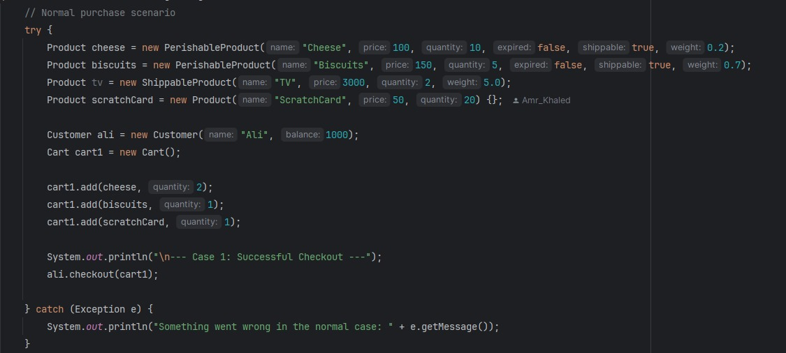
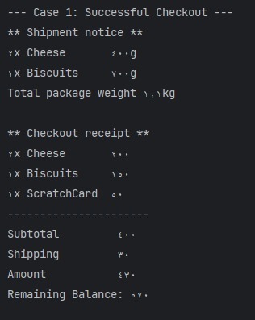
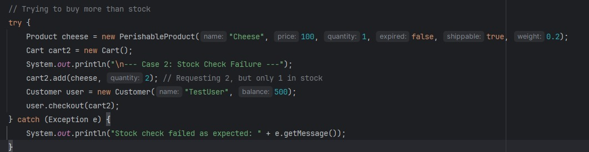
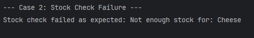
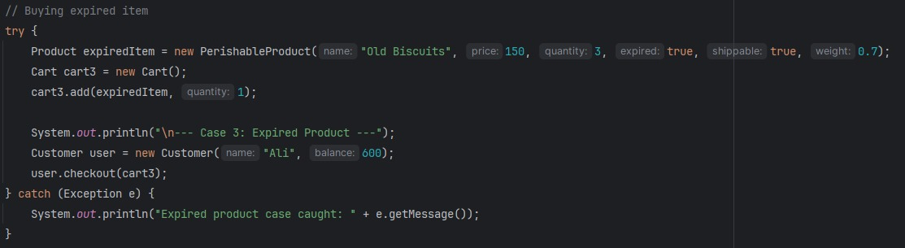
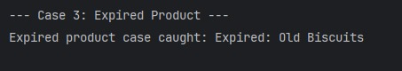
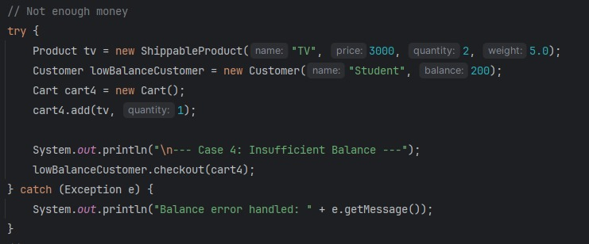
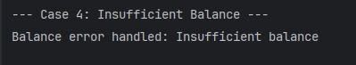

# Fawry Task - E-commerce Checkout System

This Java-based console application simulates a simple e-commerce checkout system. It includes support for perishable and shippable products, customer management, and cart operations. The system handles stock updates, balance checks, and edge case validations.

## 🧱 Project Structure

```
Fawry-Task-master/
│
├── .idea/                      # IntelliJ project files
├── src/
│   ├── Cart.java               # Manages cart operations and item addition
│   ├── CartItems.java          # Represents individual cart items
│   ├── Customer.java           # Represents the customer and checkout logic
│   ├── Main.java               # Entry point and test scenarios
│   ├── PerishableProduct.java  # Special product with expiry-based discount
│   ├── Product.java            # Abstract base class
│   ├── Shippable.java          # Interface for shipping capability
│   └── ShippableProduct.java   # Implements shipping and overrides cost
├── screenshots/                # Test case screenshots
│   ├── case1.jpg               # Successful checkout test
│   ├── case2.jpg               # Stock check failure test
│   ├── case3.jpg               # Expired product test
│   ├── case4.jpg               # Insufficient balance test
│   ├── case5.jpg               # Empty cart test
│   ├── output1.jpg             # Successful checkout output
│   ├── output2.jpg             # Stock failure output
│   ├── output3.jpg             # Expired product output
│   ├── output4.jpg             # Insufficient balance output
│   └── output5.jpg             # Empty cart output
├── Fawry.iml                   # IntelliJ module file
└── README.md                   # This file
```

## 🧪 Test Cases

### Test Case 1: Successful Checkout
**Screenshot:**   
**Output:** 

---

### Test Case 2: Over-Stock Purchase Attempt
**Screenshot:**   
**Output:** 

---

### Test Case 3: Expired Product
**Screenshot:**   
**Output:** 

---

### Test Case 4: Insufficient Balance
**Screenshot:**   
**Output:** 

---

### Test Case 5: Empty Cart
**Screenshot:**   
**Output:** 

---

## 🚀 How to Run

1. **Prerequisites:** Ensure Java 8 or above is installed on your system
2. **IDE Setup:** Open the project in IntelliJ IDEA or any Java IDE
3. **Execution:** Run the `Main.java` file
4. **Results:** Observe outputs in the terminal/console

### Command Line Execution (Optional)
```bash
# Navigate to src directory
cd src

# Compile all Java files
javac *.java

# Run the main class
java Main
```

---

## 📌 Key Features

- **Product Management:** Abstract base class with concrete implementations
- **Cart Operations:** Add items, validate stock, calculate totals
- **Customer Management:** Balance tracking and checkout validation
- **Perishable Products:** Expiry date checking and discount calculation
- **Shippable Products:** Shipping cost integration
- **Error Handling:** Comprehensive validation for edge cases

## 📌 Notes

- No external dependencies are required
- All test cases are automated and run sequentially
- Screenshots demonstrate both test inputs and expected outputs
- The system handles multiple product types with different pricing logic

## 🛠️ Technical Details

- **Language:** Java 8+
- **Architecture:** Object-oriented design with inheritance and interfaces
- **Testing:** Built-in test scenarios covering normal and edge cases
- **Validation:** Stock checking, balance verification, expiry validation
